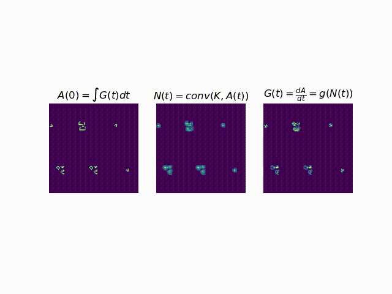
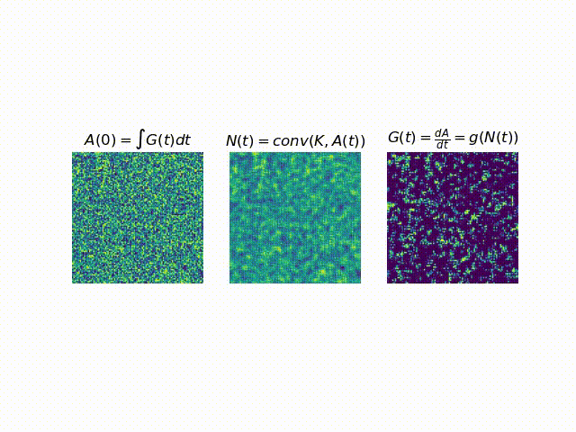
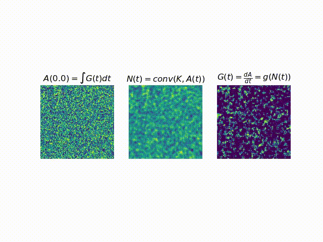

## Classical Conway

## „States of matter“ via discrete time
Each simulation with same parameters except dt:

### Compressibility / Uncertainty / Entropy

- 1.1M dt.8.mp4
- 1.5M dt.7.mp4
- 3.4M dt.65.mp4
- 3.6M dt.60.mp4
- 3.8M dt.55.mp4
- 3.7M dt.50.mp4
- 3.6M dt.45.mp4
- 234K dt.1.mp4

## Emerging structures

