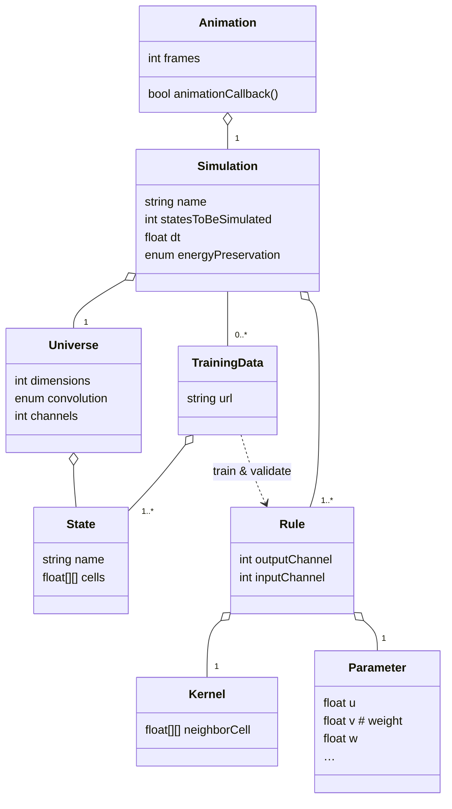

# Config

```mermaid
classDiagram
    Animation o-- "1" Simulation
    Simulation o-- "1" Universe
    Universe o-- State
    Simulation -- "0..*" TrainingData
    Simulation o-- "1..*" Rule
    TrainingData o-- "1..*" State
    TrainingData ..>Rule : train & validate
    Rule o-- "1" Kernel
    Rule o-- "1" Parameter

    class Animation{
        int frames
        bool animationCallback()
    }
    class Simulation{
        string name
        int statesToBeSimulated
        float dt
        enum energyPreservation
    }
    class Universe{
        int dimensions
        enum convolution
        int channels
    }
    class State{
        string name
        float[][] cells
    }
    class Rule{
        int outputChannel
        int inputChannel
    }
    class Kernel{
        float[][] neighborCell
    }
    class Parameter{
        float u
        float v  # weight
        float w
        …
    }
    class TrainingData{
        string url
    }
```
